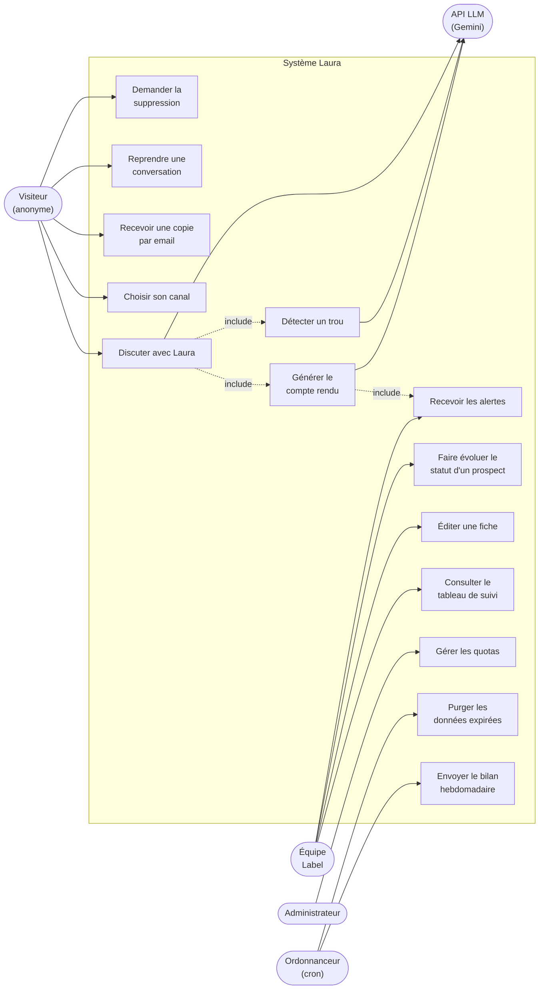
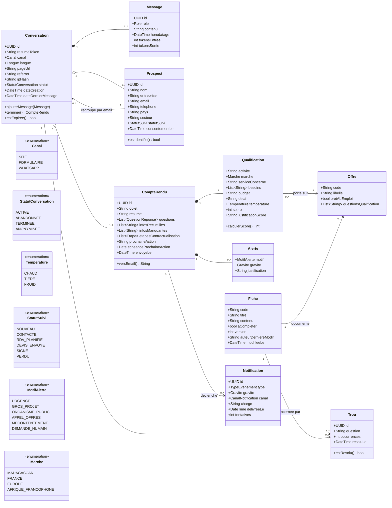
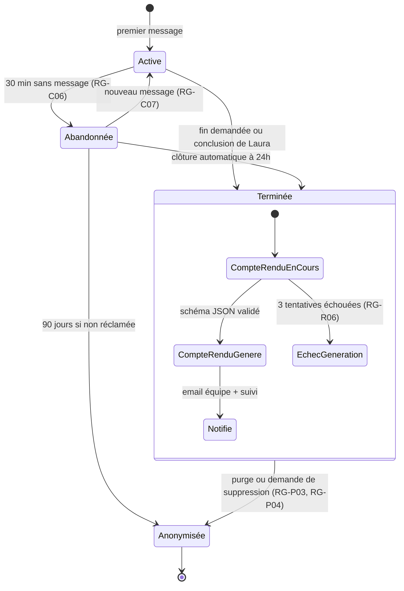
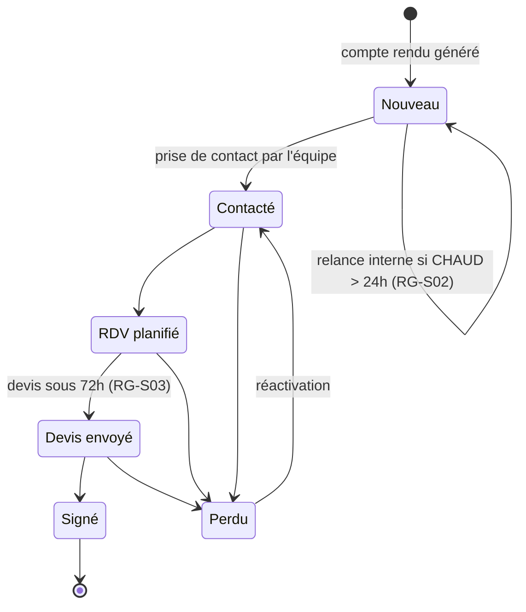
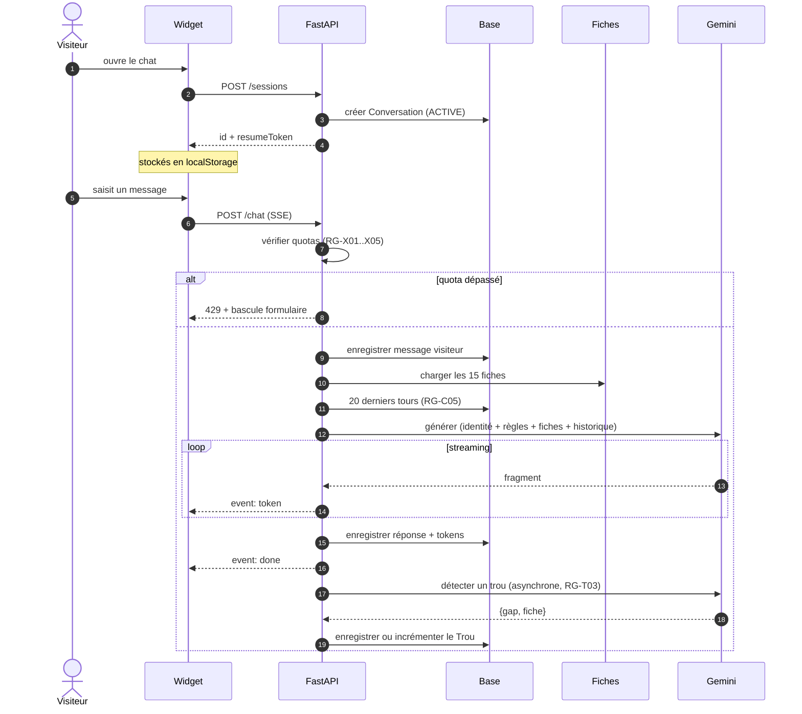
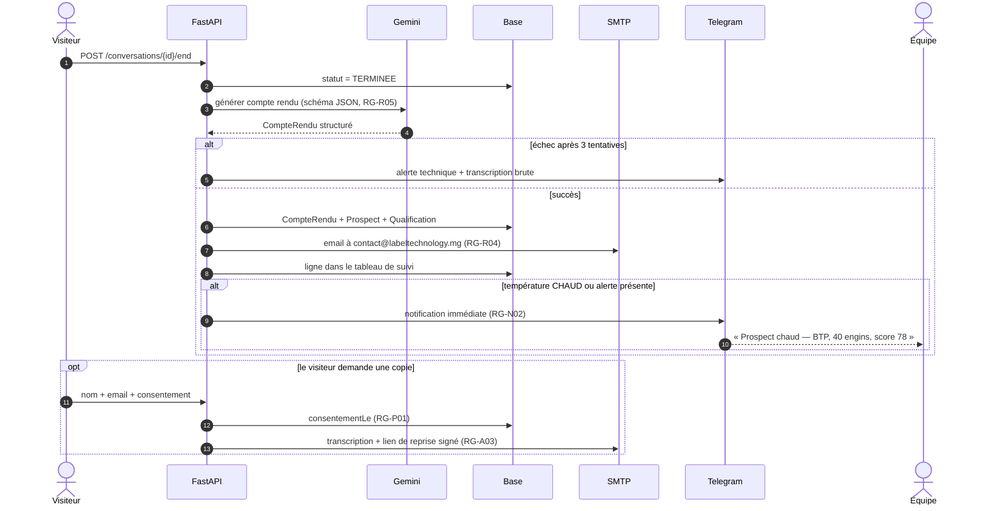
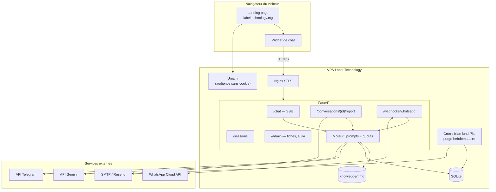

# Laura — Règles de gestion et modélisation UML

**Projet** : assistante virtuelle de Label Technology (API FastAPI)
**Version** : 1.0 — 8 octobre 2026
**Sources** : « Label Technology — Synthèse stratégie IA » (5 oct. 2026), « Compte rendu des échanges et dossier de l'assistante Laura » (5 oct. 2026)

## Légende de traçabilité

Chaque règle porte sa source, pour qu'on sache ce qui est acquis et ce qui reste à trancher.

| Code | Signification |
|---|---|
| `SYN` | Décidé dans la Synthèse stratégie IA |
| `LAU-n` | Fiche n° *n* du dossier Laura |
| `DEC` | Décidé lors des échanges techniques |
| `PROP` | **Proposition à valider par l'équipe** — ne figure dans aucun document |

---

# 1. Règles de gestion

## 1.1 Conversation et session

| ID | Règle | Source |
|---|---|---|
| RG-C01 | Une conversation est créée **dès le premier message**, sans aucune authentification. | `DEC` |
| RG-C02 | Une conversation appartient à un seul canal : `SITE`, `FORMULAIRE` ou `WHATSAPP`. Le canal est figé à la création. | `LAU-2.2` |
| RG-C03 | Une conversation mémorise sa provenance : URL de la page et référent. | `DEC` |
| RG-C04 | L'adresse IP n'est jamais stockée en clair : uniquement un haché salé. | `DEC` |
| RG-C05 | Seuls les **20 derniers tours** sont envoyés au modèle. L'historique complet reste en base. | `DEC` |
| RG-C06 | Une conversation sans message depuis 30 minutes passe en `ABANDONNEE`. | `PROP` |
| RG-C07 | Une conversation `ABANDONNEE` qui reçoit un nouveau message repasse en `ACTIVE`. | `PROP` |
| RG-C08 | Une conversation ne peut être terminée qu'une seule fois ; une conversation `TERMINEE` n'accepte plus de message. | `PROP` |
| RG-C09 | La fin de conversation déclenche obligatoirement la génération d'un compte rendu. | `LAU-2.2` |

## 1.2 Comportement de Laura

| ID | Règle | Source |
|---|---|---|
| RG-L01 | Laura se présente **systématiquement** comme « l'assistante virtuelle de Label Technology », parle au féminin, et déclare ne pas être humaine si on le lui demande. | `SYN`, `LAU-2.4` |
| RG-L02 | Laura répond dans la langue du visiteur : français, anglais ou malgache. | `LAU-2.2` |
| RG-L03 | **Toute information absente des fiches est renvoyée à l'équipe.** Interdiction d'inventer un prix, un délai, une fonctionnalité, un nom de client, un effectif, une certification. | `LAU-14` |
| RG-L04 | Laura ne cite jamais un effectif chiffré. | `LAU-4` |
| RG-L05 | Laura ne présente pas les statistiques du site comme des garanties personnelles. | `LAU-14` |
| RG-L06 | Aucun conseil juridique, fiscal ou médical. Renvoi vers l'équipe ou l'expert-comptable du client. | `LAU-11`, `LAU-14` |
| RG-L07 | Laura ne demande jamais de mot de passe, numéro de carte ou donnée sensible. | `LAU-14` |
| RG-L08 | Si une offre « logiciel prêt à l'emploi » correspond au besoin, elle est proposée **en priorité**. | `LAU-2.2` |
| RG-L09 | Les questions de qualification sont posées **une ou deux à la fois**, jamais en interrogatoire. | `LAU-14` |
| RG-L10 | Toute réponse vise une prochaine étape concrète : démo, appel de 20 minutes, ou devis. | `LAU-14` |
| RG-L11 | Avant la fin, Laura recueille : nom, entreprise, et email **ou** téléphone. | `LAU-14` |
| RG-L12 | Demande de parler à un humain : acceptée immédiatement, sans insister. Créneau préféré demandé. | `LAU-13` |
| RG-L13 | Demande hors champ (candidature, partenariat, fournisseur) : orientée (`recrutement@labeltechnology.mg`) et consignée. | `LAU-13` |
| RG-L14 | Longueur selon le canal : chat 2 à 5 phrases, WhatsApp 1 à 3 phrases, email structuré (salutation, présentation, 3 questions max, proposition de rendez-vous, signature). | `LAU-2.4` |
| RG-L15 | Signature des emails : « Laura, assistante virtuelle de Label Technology ». | `SYN` |
| RG-L16 | Référentiel comptable malgache = **PCG 2005**. Le SYSCOHADA ne doit jamais être cité pour Madagascar. | `SYN` |
| RG-L17 | Réponse du canal `FORMULAIRE` : générée en **brouillon soumis à validation humaine**, jamais envoyée automatiquement au prospect. | `SYN`, `LAU-2.6` |

> **Point à trancher (RG-L17)** : la décision « rien n'est envoyé sans validation humaine » couvre-t-elle les réponses de Laura aux formulaires, ou seulement les publications marketing ? Le prototype crée un *brouillon* Gmail, ce qui suggère la validation. À confirmer.

## 1.3 Fiches de connaissances

| ID | Règle | Source |
|---|---|---|
| RG-F01 | Les 15 fiches sont la **seule source de vérité** de Laura sur l'entreprise. | `LAU-2.7` |
| RG-F02 | Les fiches sont modifiables par l'équipe ; la réponse suivante en tient compte, sans redéploiement. | `LAU-2.2` |
| RG-F03 | Une fiche marquée `A_COMPLETER` interdit toute affirmation sur son sujet : réponse « l'équipe vous confirme ». | `LAU-15` |
| RG-F04 | Cinq sujets sont à compléter : prix des 4 logiciels, prix journalier d'un développeur dédié, téléphone et WhatsApp, lien de prise de rendez-vous, délai de réponse cible. | `LAU-15` |
| RG-F05 | Chaque modification de fiche est versionnée et horodatée, avec son auteur. | `PROP` |
| RG-F06 | Prix publiables sans validation : développement à partir de 800 €, comptabilité 250 à 600 €/mois. Tout autre prix passe par l'équipe. | `LAU-13` |

## 1.4 Qualification du prospect

| ID | Règle | Source |
|---|---|---|
| RG-Q01 | Les questions de qualification sont celles de la fiche du métier concerné, pas une liste générique. | `LAU-2.2` |
| RG-Q02 | Chaque compte rendu porte une température : `CHAUD`, `TIEDE` ou `FROID`, et un score sur 100 justifié. | `LAU-2.5` |
| RG-Q03 | **Grille de score proposée** (total 100) : identité complète 20 ; besoin rattaché à une offre 20 ; budget évoqué 15 ; délai inférieur à 3 mois 15 ; interlocuteur décideur 10 ; volume renseigné (véhicules, élèves, utilisateurs…) 10 ; demande explicite de démo, devis ou appel 10. | `PROP` |
| RG-Q04 | **Seuils proposés** : score ≥ 70 → `CHAUD` ; 40 à 69 → `TIEDE` ; < 40 → `FROID`. | `PROP` |
| RG-Q05 | Le contexte de réponse s'adapte au marché : Madagascar (Mobile Money, coupures, Ariary, marchés publics) ou France/Europe (fuseau, RGPD, propriété du code). | `LAU-11`, `LAU-12` |

> **Point à trancher (RG-Q03, RG-Q04)** : les documents exigent un score sur 100 sans en définir le calcul. Cette grille le rend reproductible et auditable — elle doit être validée, puis ajustée après 20 ou 30 conversations réelles.

## 1.5 Compte rendu

| ID | Règle | Source |
|---|---|---|
| RG-R01 | Le compte rendu comporte 9 rubriques obligatoires : objet, prospect, activité/marché/service, résumé et besoins, questions posées, température et score, infos recueillies et manquantes, alerte équipe, étapes pour contractualiser. | `LAU-2.5` |
| RG-R02 | Le résumé fait 3 à 4 phrases. | `LAU-2.5` |
| RG-R03 | La rubrique « étapes pour contractualiser » est ordonnée et se termine par une prochaine action **avec délai**. | `LAU-2.5` |
| RG-R04 | Le compte rendu est envoyé par email à l'équipe **et** ajouté au tableau de suivi des prospects. | `SYN` |
| RG-R05 | Le compte rendu est produit par appel à schéma JSON contraint : aucune rubrique ne peut manquer. | `DEC` |
| RG-R06 | Un échec de génération est réessayé deux fois, puis alerte technique avec la transcription brute en pièce jointe. | `PROP` |

## 1.6 Alertes et notifications

| ID | Règle | Source |
|---|---|---|
| RG-N01 | Six motifs déclenchent une alerte équipe : demande urgente, gros projet, organisme public, appel d'offres, client mécontent, demande de parler à un humain. | `LAU-14`, `LAU-2.5` |
| RG-N02 | Alerte ou prospect `CHAUD` → notification immédiate sur le canal interne (Telegram). | `DEC` |
| RG-N03 | Fin de conversation → compte rendu par email, quelle que soit la température. | `SYN` |
| RG-N04 | Incident technique (quota API dépassé, modèle indisponible, échec d'envoi) → notification immédiate. | `DEC` |
| RG-N05 | Bilan hebdomadaire envoyé **le lundi à 7h, heure de Madagascar** : conversations, prospects par température, trous détectés, pages d'entrée, taux d'abandon. | `SYN`, `DEC` |
| RG-N06 | Les alertes internes passent par Telegram, pas par WhatsApp : l'API WhatsApp Cloud interdit l'envoi hors fenêtre de 24h sans *template* pré-approuvé. | `DEC` |
| RG-N07 | Une notification échouée est réessayée 3 fois en recul exponentiel, puis consignée en erreur. | `PROP` |

## 1.7 Suivi commercial

| ID | Règle | Source |
|---|---|---|
| RG-S01 | Chaque prospect suit un cycle : `NOUVEAU` → `CONTACTE` → `RDV_PLANIFIE` → `DEVIS_ENVOYE` → `SIGNE` ou `PERDU`. | `PROP` |
| RG-S02 | Un prospect `CHAUD` non passé en `CONTACTE` sous 24h ouvrées déclenche une relance interne. | `PROP` |
| RG-S03 | Engagement public : devis gratuit avec proposition concrète sous 72h maximum. | `LAU-1` |
| RG-S04 | Deux conversations partageant la même adresse email sont rattachées au même prospect. | `PROP` |

> **Point à trancher (RG-S03)** : la synthèse demande d'harmoniser le délai affiché — 72h actuellement, ou 24h. Le choix doit être fait avant la mise en ligne, car Laura l'annonce.

## 1.8 Données personnelles (RGPD)

| ID | Règle | Source |
|---|---|---|
| RG-P01 | Le consentement est recueilli explicitement, par case à cocher, avant tout stockage d'email à fin de prospection. Date conservée. | `SYN` (CNIL) |
| RG-P02 | Tout email sortant mentionne l'origine des données et un moyen de refus simple. | `SYN` (CNIL) |
| RG-P03 | Conservation : conversation anonyme non réclamée **90 jours** ; prospect identifié **3 ans après le dernier contact**. Purge automatique hebdomadaire. | `PROP` (CNIL) |
| RG-P04 | Le visiteur peut demander la suppression de ses données ; la conversation est anonymisée, pas effacée (statistiques préservées). | `PROP` |
| RG-P05 | La mesure d'audience se fait sans cookie (Umami auto-hébergé), donc sans bandeau de consentement. | `DEC` |

## 1.9 Accès du visiteur à sa conversation

| ID | Règle | Source |
|---|---|---|
| RG-A01 | Aucun compte, aucun mot de passe. L'accès repose sur un jeton de reprise de 32 octets aléatoires. | `DEC` |
| RG-A02 | Le jeton n'est jamais devinable ni séquentiel. Une conversation sans jeton valide n'est jamais affichée. | `DEC` |
| RG-A03 | La copie de l'échange est envoyée **uniquement** à l'adresse email saisie — ce qui vaut vérification implicite. | `DEC` |
| RG-A04 | Le lien de reprise permet de relire et de poursuivre l'échange, pas de modifier l'historique. | `PROP` |

## 1.10 Sécurité et maîtrise des coûts

| ID | Règle | Source |
|---|---|---|
| RG-X01 | Message entrant limité à 2 000 caractères. | `DEC` |
| RG-X02 | 30 messages maximum par conversation. | `DEC` |
| RG-X03 | 600 tokens maximum en sortie par réponse. | `DEC` |
| RG-X04 | Limite par IP : 2 messages par 10 secondes, 10 conversations par jour. | `DEC` |
| RG-X05 | L'origine des requêtes est vérifiée : seul `labeltechnology.mg` est autorisé. | `DEC` |
| RG-X06 | Les endpoints d'administration (fiches, suivi, statistiques) exigent une authentification. | `DEC` |
| RG-X07 | Un plafond de dépense mensuel est défini ; à 80 % une alerte est émise, à 100 % Laura passe en mode dégradé (message d'attente et bascule vers le formulaire). | `PROP` |

## 1.11 Apprentissage et amélioration continue

| ID | Règle | Source |
|---|---|---|
| RG-T01 | Laura n'est **jamais** réentraînée. Son amélioration passe exclusivement par l'édition des fiches. | `DEC` |
| RG-T02 | Tout renvoi vers l'équipe faute d'information est enregistré comme un **trou**, avec la question et la fiche concernée. | `DEC` |
| RG-T03 | La détection de trou est asynchrone : elle ne retarde jamais la réponse au visiteur. | `DEC` |
| RG-T04 | Les trous sont classés par fréquence et constituent la liste de travail de l'équipe. | `DEC` |
| RG-T05 | Un trou est résolu quand la fiche correspondante est complétée. | `DEC` |
| RG-T06 | Laura n'a pas accès à internet. Toute connaissance externe passe par une fiche. | `SYN` |

---

# 2. Modélisation UML

## 2.1 Diagramme de cas d'utilisation

## 2.2 Diagramme de classes — modèle du domaine

## 2.3 Diagramme d'états — Conversation

## 2.4 Diagramme d'états — Prospect

## 2.5 Diagramme de séquence — échange de messages

## 2.6 Diagramme de séquence — fin de conversation et notifications

## 2.7 Diagramme de composants — déploiement

---

# 3. Points à trancher avant développement

Ces décisions bloquent ou modifient l'implémentation. Elles reprennent les règles marquées `PROP` les plus structurantes.

| # | Question | Règle | Impact |
|---|---|---|---|
| 1 | Les réponses de Laura au formulaire sont-elles envoyées automatiquement ou validées par un humain ? | RG-L17 | Change le flux complet du canal `FORMULAIRE` |
| 2 | La grille de score sur 100 est-elle validée ? | RG-Q03, RG-Q04 | Détermine quels prospects déclenchent une alerte immédiate |
| 3 | Délai de réponse affiché : 72h ou 24h ? | RG-S03 | Annoncé par Laura, donc engageant |
| 4 | Quel plafond de dépense mensuel pour l'API ? | RG-X07 | Conditionne le mode dégradé |
| 5 | Durées de conservation : 90 jours et 3 ans sont-elles retenues ? | RG-P03 | Obligation CNIL pour les prospects français |
| 6 | Qui reçoit les alertes Telegram, et sur quel groupe ? | RG-N02 | Prérequis au premier déploiement |
| 7 | Les 5 fiches « à compléter » : quelles valeurs ? | RG-F04 | Tant qu'elles manquent, Laura renvoie à l'équipe sur les prix |
